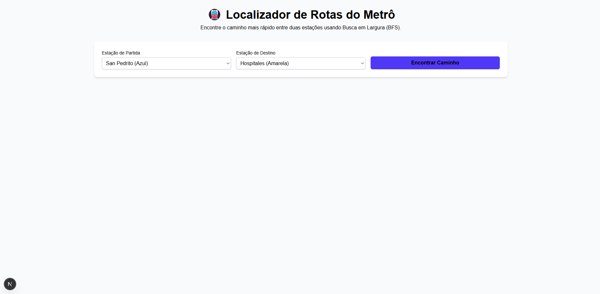
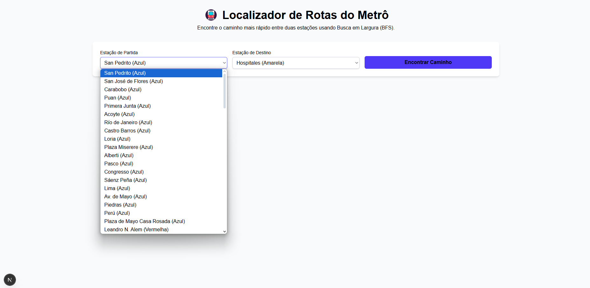
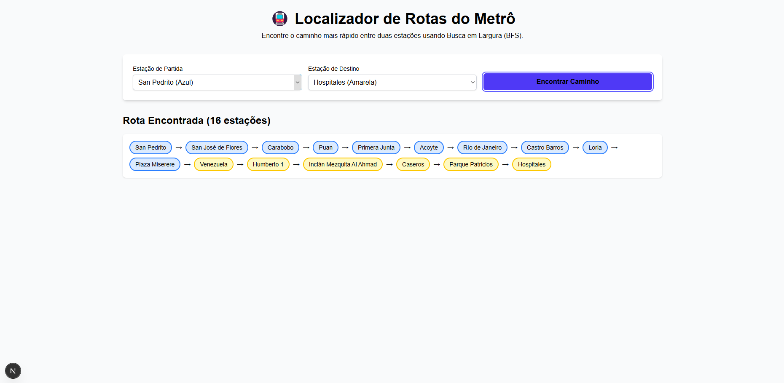

# Grafos1-Dupla-34

Temas:
 - Grafos1

**Número da Lista**: x<br>
**Conteúdo da Disciplina**: Grafos 1<br>

## Alunos
|Matrícula | Aluno |
| -- | -- |
| 20/2045769  |  Gabriel Saraiva Canabrava|
| 19/0087188  |  Fillipe Souto de Andrade |

## Sobre 

Este projeto é uma aplicação web interativa que simula o sistema de metrô de Buenos Aires, desenvolvida como parte da disciplina de Grafos 1. A aplicação utiliza conceitos fundamentais da teoria dos grafos para modelar a rede de transporte subterrâneo da capital argentina.

### Objetivo
O projeto tem como objetivo facilitar a navegação no sistema de metrô de Buenos Aires, fornecendo aos usuários uma ferramenta para encontrar rotas otimizadas entre estações, demonstrando a aplicação de algoritmos de grafos em problemas reais de transporte urbano.

### Tecnologias Utilizadas
- **Algoritmo BFS**: Implementado para encontrar o caminho mais  grafo não-direcionado
- **Next.js**: Framework React para desenvolvimento web
- **TypeScript**: Linguagem de programação para maior robustez

### Funcionalidades
- Cálculo automático de rotas entre estações
- Interface para seleção de origem e destino
- Exibição do caminho mais eficiente

## Screenshots

### Página Principal


### Seleção de Estações


### Resultado da Rota


## Instalação 

### Pré-requisitos
- Node.js (versão 18 ou superior)
- npm ou yarn

### Tecnologias
- **Linguagem**: TypeScript
- **Framework**: Next.js

### Passos para instalação

1. Instale as dependências:
```bash
npm install
```

2. Execute o projeto em modo de desenvolvimento:
```bash
npm run dev
```

3. Acesse a aplicação no navegador:
```
http://localhost:3000
```


## Videos

https://drive.google.com/file/d/1Ccp-FqAV8oWVwsFSZStzc74HTUSBfY3u/view?usp=sharing

